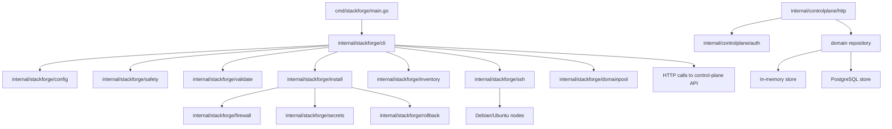
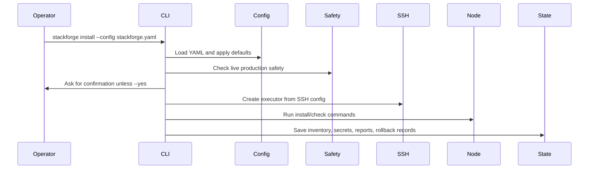
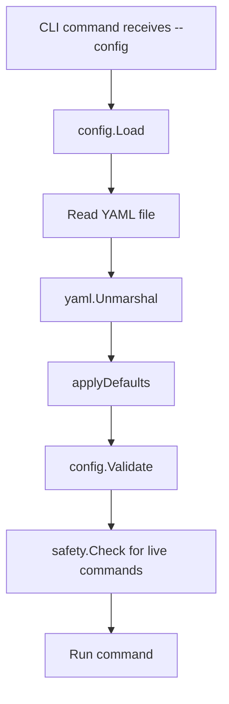
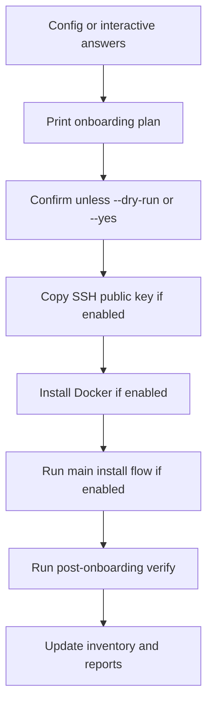
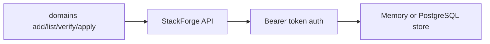
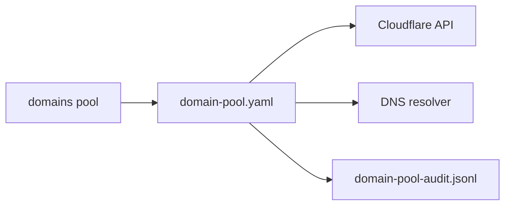

# Architecture

StackForge has two main parts:

- A CLI in `internal/stackforge`.
- A small HTTP control-plane API in `internal/controlplane`.

The CLI is the main operator interface. It reads YAML config, validates safety rules, connects to servers over SSH, installs components, writes local state, and calls the control-plane API for domain commands.

The control-plane API stores domain records and exposes authenticated endpoints under `/api/v1`.

## System Overview

## Main Entry Points

- `cmd/stackforge/main.go`: process entry point.
- `internal/stackforge/cli/cli.go`: root command, global flags, most CLI commands.
- `internal/stackforge/cli/onboarding.go`: onboarding, bootstrap, components, firewall, and domain-pool commands.
- `internal/controlplane/http/server.go`: HTTP API server used by `stackforge serve`.

`main()` only calls `cli.Execute()` and exits with code `1` when the command returns an error.

## CLI Architecture

The CLI uses Cobra.

`newRoot()` creates the `stackforge` root command and registers global flags:

- `--config`
- `--state-dir`
- `--cluster`
- `--output text|json`
- `--dry-run`
- `--yes`
- `--verbose`
- `--log-level`
- `--no-color`
- `--allow-no-firewall`
- `--allow-example-config`
- `--allow-public-ssh`
- `--confirm-production`

It then adds these top-level commands:

- `version`
- `install`
- `status`
- `inventory`
- `nodes`
- `components`
- `firewall`
- `domains`
- `consul`
- `nomad`
- `traefik`
- `db`
- `backup`
- `rollback`
- `validate`
- `verify`
- `upgrade`
- `uninstall`
- `serve`

Viper binds the flags, but the current code mainly reads values from the `rootOpts` struct.

## Command Flow

Most live CLI commands follow this pattern:

Dry-run mode follows the same planning path but does not create an SSH executor for install steps. It records planned steps as `dry-run`.

## Package Breakdown

### `internal/stackforge/cli`

Registers all CLI commands and connects command handlers to internal packages.

Important functions:

- `newRoot()`
- `installCmd()`
- `nodesCmd()`
- `componentsCmd()`
- `firewallCmd()`
- `domainsCmd()`
- `domainsPoolCmd()`
- `serveCmd()`
- `apiRequest()`

### `internal/stackforge/config`

Loads YAML config and applies defaults.

It validates:

- cluster name
- at least one node
- control-plane domain
- admin API keys
- database engine value
- node names and addresses
- odd Consul/Nomad server counts
- Traefik dashboard auth
- valid CIDRs
- private/public address safety for internal communication

### `internal/stackforge/safety`

Runs production safety checks that are stricter than basic config validation.

It blocks:

- production live actions without `--confirm-production`
- example/demo cluster names
- example IPs and domains during live install
- public admin CIDRs
- public SSH CIDRs unless explicitly allowed
- public Traefik dashboard without auth
- public database traffic
- public internal API exposure
- Cloudflare config without token env name when Cloudflare is enabled

### `internal/stackforge/ssh`

Implements `remoteexec.Executor` over SSH.

It supports:

- private key auth
- password auth for bootstrap
- optional sudo prefix for non-root users
- timeout handling
- secret redaction from stdout/stderr

Current risk: host key verification uses `ssh.InsecureIgnoreHostKey()`.

### `internal/stackforge/bootstrap`

Copies a local public SSH key to remote nodes and verifies key-based access.

Password auth is only used for initial key copy and is not stored.

### `internal/stackforge/install`

Builds and runs the main install plan.

It creates:

- `inventory.yaml`
- `generated-secrets.yaml`
- `install-report.json`
- root-level `stackforge-install-report.json`
- root-level `STACKFORGE_INSTALL_REPORT.md`
- rollback records under `rollback/`

Install steps include:

1. SSH connectivity.
2. OS support check.
3. Base package installation.
4. UFW firewall configuration unless bypassed.
5. Consul install.
6. Nomad install.
7. Traefik install.
8. PostgreSQL install.
9. StackForge control-plane service install.
10. Report generation.

### `internal/stackforge/firewall`

Builds UFW rules from config and rejects public exposure for internal/admin services.

The generated rules allow:

- SSH from `allowed_ssh_cidrs`.
- HTTP/HTTPS from the public internet.
- StackForge API, Consul HTTP/UI, Nomad HTTP/UI, and Traefik dashboard from `allowed_admin_cidrs`.
- Consul, Nomad, and database internal ports from private node traffic.

### `internal/stackforge/inventory`

Stores desired and observed cluster state.

Inventory can be created from config, updated during install, refreshed from live nodes, and used by status, backup, verify, components, and rollback flows.

### `internal/stackforge/domainpool`

Manages a local domain pool in `domain-pool.yaml`.

It can:

- add entries
- disable entries
- apply DNS through Cloudflare
- verify A or CNAME records
- write audit records to `domain-pool-audit.jsonl`

### `internal/controlplane/http`

Implements the HTTP API used by `stackforge serve`.

Important routes:

- `GET /health`
- `GET /ready`
- `POST /api/v1/domains`
- `GET /api/v1/domains`
- `GET /api/v1/domains/{id}`
- `DELETE /api/v1/domains/{id}`
- `POST /api/v1/domains/{id}/verification-token`
- `POST /api/v1/domains/{id}/verify`
- `POST /api/v1/domains/{id}/dns/apply`
- `POST /api/v1/domains/{id}/routing/apply`
- `POST /api/v1/domains/{id}/reconcile`

The API uses bearer token auth for `/api/v1`.

### `internal/controlplane/domain`

Defines the domain model and repository interface.

There are two stores:

- `NewStore()`: in-memory store.
- `NewPostgresStore()`: PostgreSQL-backed store that runs schema creation at startup.

### `internal/controlplane/reconcile`

Contains domain reconciliation logic, but the HTTP server currently calls it without external clients. That means API reconciliation returns an error instead of pretending to apply DNS/routing.

## Config Loading Flow

Defaults:

- `cluster.environment`: `production`
- `cluster.datacenter`: `dc1`
- `ssh.user`: `root`
- `ssh.port`: `22`
- `control_plane.api_port`: `8080`
- `database.engine`: `postgres`
- `consul.version`: `latest-stable`
- `nomad.version`: `latest-stable`
- `traefik.version`: `latest-stable`

## Server Onboarding Flow

`stackforge nodes onboard` works in two modes.

With `--config`, it loads config and builds a plan from it.

Without `--config`, it requires an interactive TTY and asks for cluster, network, server, SSH, role, and install choices.

Flow:

## Installation Flow

`install.Run()` is the core install engine.

It:

1. Validates config.
2. Runs safety checks for live installs.
3. Creates the state directory and `logs/`.
4. Loads or generates local secrets.
5. Writes initial inventory.
6. Builds the step plan.
7. Optionally skips completed steps when `--resume` is used.
8. Runs check, apply, and verify functions per step.
9. Saves rollback records before live changes.
10. Updates inventory after each step.
11. Writes install reports.
12. Refreshes inventory from live nodes at the end.

## Domain And DNS Flow

There are two domain paths.

The API path:

The local domain-pool path:

API `apply-dns` and `apply-routing` currently return accepted responses after ownership verification. They do not wire live Cloudflare, Consul, Nomad, or Traefik clients in the HTTP server.

The local domain-pool `apply-dns` command does call Cloudflare directly.

## Firewall And Port Flow

`firewall.BuildPlanWithOptions()` creates a UFW plan from config.

`stackforge firewall plan` prints the rules.

`stackforge firewall apply`:

1. Loads config.
2. Builds and validates the plan.
3. Prints the rules.
4. Returns early in `--dry-run`.
5. Requires confirmation unless `--yes`.
6. Runs UFW backup and UFW commands on every configured node over SSH.

## Validation Flow

`stackforge validate` has local and live modes.

Local validation:

- loads YAML
- runs config validation
- runs safety checks
- checks domain placeholder values
- checks Cloudflare token presence when enabled
- builds firewall plan
- marks SSH/OS/sudo/systemd/package/disk/RAM/ports/firewall checks as planned

Live validation with `--live`:

- connects over SSH
- runs a shell preflight script
- parses OS, sudo, apt, systemd, disk, RAM, firewall, listening ports, and interfaces
- fails if required ports are already listening

## Error Handling Strategy

Most commands return errors directly to Cobra. `main()` exits with status `1` when an error reaches the top.

Install step errors are also written into:

- inventory failed step fields
- `install-report.json`
- `STACKFORGE_INSTALL_REPORT.md`
- suggested recovery text

Remote command stderr/stdout goes through secret redaction when secret values are provided.

## Logging

There is no broad structured logging system in the CLI. Most CLI output is printed with `fmt`.

The control-plane API accepts a `slog.Logger`, but most handlers simply write HTTP responses.

`--log-level`, `--verbose`, and `--no-color` are registered global flags. They are not widely used in the current implementation.
